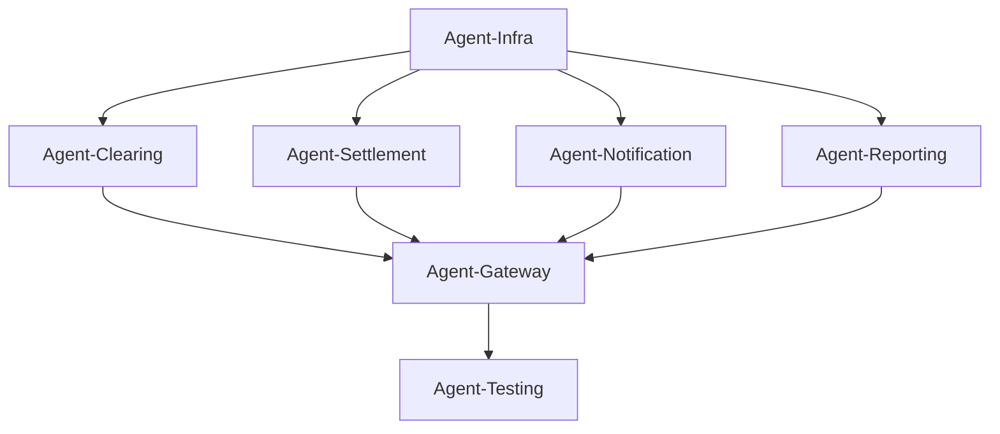

# AGENT IMPLEMENTATION GUIDE - DelTran MVP

## 📋 Обзор

Этот документ определяет роли и задачи для параллельной реализации проекта DelTran с использованием специализированных агентов. Каждый агент работает автономно над своим сервисом, следуя детальной спецификации.

---

## 🎯 СТРАТЕГИЯ РЕАЛИЗАЦИИ

### Фазы развертывания:
1. **Фаза 1 (Инфраструктура)**: Agent-Infra
2. **Фаза 2 (Core Services)**: Agent-Clearing + Agent-Settlement (параллельно)
3. **Фаза 3 (Supporting Services)**: Agent-Notification + Agent-Reporting (параллельно)
4. **Фаза 4 (Integration)**: Agent-Gateway + Agent-Testing

---

## 🤖 AGENT 1: INFRASTRUCTURE AGENT (Agent-Infra)

### Роль:
Специалист по инфраструктуре - настройка базовых компонентов, необходимых для работы всех сервисов.

### Задачи:
1. **NATS JetStream Setup**
   - Установить NATS Server
   - Настроить JetStream streams для событий
   - Создать subjects для каждого типа событий
   - Настроить retention policies (7d, 30d, 90d)
   - Тестировать pub/sub механизм

2. **Database Schema Updates**
   - Выполнить миграции для clearing-engine
   - Выполнить миграции для settlement-engine
   - Выполнить миграции для notification-engine
   - Выполнить миграции для reporting-engine
   - Создать materialized views для reporting

3. **Envoy Proxy Configuration**
   - Настроить Envoy как edge proxy
   - Конфигурация mTLS termination
   - Rate limiting policies
   - Circuit breaker settings
   - Routing rules к Gateway

### Входные данные:
- `infra/docker-compose.yml` - текущая конфигурация
- SQL скрипты из спецификаций сервисов
- Требования к NATS из `COMPLETE_SYSTEM_SPECIFICATION.md`

### Ожидаемый результат:
```yaml
Deliverables:
  - ✅ NATS JetStream работает с настроенными streams
  - ✅ База данных имеет все необходимые таблицы
  - ✅ Envoy proxy настроен и готов к использованию
  - ✅ docker-compose.yml обновлен со всеми сервисами
  - ✅ Документация по инфраструктуре

Test Criteria:
  - NATS принимает и доставляет сообщения
  - PostgreSQL доступен и схемы созданы
  - Envoy маршрутизирует запросы корректно
```

### Критические файлы для создания:
```
infra/
├── nats/
│   └── nats-jetstream.conf
├── envoy/
│   └── envoy.yaml
├── sql/
│   ├── 005_clearing_engine.sql
│   ├── 006_settlement_engine.sql
│   ├── 007_notification_engine.sql
│   └── 008_reporting_engine.sql
└── docker-compose.updated.yml
```

---

## 🤖 AGENT 2: CLEARING ENGINE AGENT (Agent-Clearing)

### Роль:
Rust специалист по финансовым операциям - реализация clearing engine с атомарными операциями.

### Задачи:
1. **Atomic Operations Controller**
   - Реализовать `AtomicController` с checkpoint механизмом
   - Создать `AtomicOperation` с rollback логикой
   - Реализовать `Checkpoint` tracking
   - Тестировать rollback при различных сценариях сбоев

2. **Window Management**
   - Реализовать `WindowManager` с 6-часовыми циклами
   - Scheduler на основе tokio-cron-scheduler
   - Логика открытия/закрытия окон
   - Статус tracking для каждого окна

3. **gRPC Server Implementation**
   - Определить protobuf схему для ClearingService
   - Реализовать gRPC сервер на tonic
   - StreamWindowEvents для real-time updates
   - Client для obligation-engine и settlement-engine

4. **Orchestration Logic**
   - Получение obligations от obligation-engine (gRPC)
   - Запуск netting процесса
   - Генерация settlement instructions
   - Отправка в settlement-engine (gRPC)

### Входные данные:
- `services/clearing-engine/SPECIFICATION.md` - полная спецификация
- Существующий код obligation-engine для интеграции
- Database schema от Agent-Infra

### Ожидаемый результат:
```yaml
Deliverables:
  - ✅ Полностью функциональный clearing-engine
  - ✅ Атомарные операции с rollback
  - ✅ gRPC сервер на порту 50055
  - ✅ HTTP API на порту 8085
  - ✅ Unit тесты (coverage > 70%)
  - ✅ Integration тесты с obligation-engine

Test Criteria:
  - Окна открываются/закрываются по расписанию
  - Rollback корректно откатывает операции
  - gRPC streaming работает без ошибок
  - Netting запускается автоматически каждые 6 часов
```

### Критические файлы для реализации:
```
services/clearing-engine/
├── proto/
│   └── clearing.proto
├── src/
│   ├── main.rs
│   ├── server.rs
│   ├── atomic/
│   │   ├── mod.rs
│   │   ├── controller.rs
│   │   ├── operation.rs
│   │   └── checkpoint.rs
│   ├── window/
│   │   ├── mod.rs
│   │   ├── manager.rs
│   │   └── scheduler.rs
│   ├── orchestration/
│   │   ├── mod.rs
│   │   └── processor.rs
│   ├── grpc/
│   │   ├── mod.rs
│   │   ├── server.rs
│   │   └── clients.rs
│   └── config.rs
└── tests/
    ├── atomic_tests.rs
    └── integration_tests.rs
```

---

## 🤖 AGENT 3: SETTLEMENT ENGINE AGENT (Agent-Settlement)

### Роль:
Rust специалист по критическим финансовым расчетам - реализация settlement engine с максимальной надежностью.

### Задачи:
1. **Atomic Settlement Executor**
   - Реализовать `SettlementExecutor` с atomic controls
   - Fund locking механизм против двойного списания
   - Multi-step settlement с checkpoints на каждом шаге
   - Validation → Lock → Transfer → Confirm → Finalize

2. **Bank Integration Layer**
   - Mock Bank Client для демонстрации
   - Trait `BankClient` для будущих реальных интеграций
   - Async transfer initiation
   - Status polling с timeout
   - Cancel/compensation transactions

3. **Nostro/Vostro Account Management**
   - CRUD операции для nostro accounts
   - CRUD операции для vostro accounts
   - Balance tracking
   - Available balance calculation с fund locks

4. **Reconciliation Engine**
   - Автоматическая сверка балансов
   - Поиск несовпадений (discrepancies)
   - Идентификация unmatched transactions
   - Scheduled reconciliation каждые 6 часов

5. **gRPC Server Implementation**
   - Protobuf схема для SettlementService
   - ExecuteSettlement endpoint
   - ReconcileAccounts endpoint
   - StreamSettlementEvents для real-time

### Входные данные:
- `services/settlement-engine/SPECIFICATION.md` - полная спецификация
- Database schema от Agent-Infra
- gRPC endpoints clearing-engine для интеграции

### Ожидаемый результат:
```yaml
Deliverables:
  - ✅ Полностью функциональный settlement-engine
  - ✅ Атомарные settlement с rollback
  - ✅ Fund locking работает корректно
  - ✅ Mock bank API для демонстрации
  - ✅ Reconciliation engine
  - ✅ gRPC сервер на порту 50056
  - ✅ HTTP API на порту 8086
  - ✅ Unit тесты (coverage > 75%)
  - ✅ Failure scenario тесты

Test Criteria:
  - Settlement откатывается при network failure
  - Fund locks предотвращают двойное списание
  - Reconciliation обнаруживает discrepancies
  - Mock bank API симулирует различные сценарии
  - Timeout handling работает корректно
```

### Критические файлы для реализации:
```
services/settlement-engine/
├── proto/
│   └── settlement.proto
├── src/
│   ├── main.rs
│   ├── server.rs
│   ├── settlement/
│   │   ├── mod.rs
│   │   ├── executor.rs
│   │   ├── atomic.rs
│   │   ├── rollback.rs
│   │   └── validator.rs
│   ├── accounts/
│   │   ├── mod.rs
│   │   ├── nostro.rs
│   │   ├── vostro.rs
│   │   └── reconciliation.rs
│   ├── integration/
│   │   ├── mod.rs
│   │   ├── mock.rs
│   │   ├── swift.rs (stub)
│   │   └── sepa.rs (stub)
│   ├── recovery/
│   │   ├── mod.rs
│   │   ├── retry.rs
│   │   └── compensation.rs
│   └── grpc/
│       ├── mod.rs
│       └── server.rs
└── tests/
    ├── settlement_tests.rs
    ├── reconciliation_tests.rs
    └── failure_tests.rs
```

---

## 🤖 AGENT 4: NOTIFICATION ENGINE AGENT (Agent-Notification)

### Роль:
Go специалист по real-time коммуникациям - реализация notification engine с WebSocket и NATS.

### Задачи:
1. **WebSocket Hub**
   - Реализовать `Hub` с support 10,000+ connections
   - Connection management (register/unregister)
   - Broadcast механизм с filtering
   - Heartbeat/ping-pong для keep-alive
   - Redis integration для horizontal scaling

2. **NATS JetStream Consumer**
   - Subscribe на все event topics
   - Durable consumer для гарантированной доставки
   - Fetch с ack mechanism
   - Parallel processing (10 messages batch)
   - Error handling с retry logic

3. **Notification Dispatcher**
   - Email отправка через SendGrid/SMTP
   - SMS отправка через Twilio (mock для MVP)
   - WebSocket broadcast
   - Push notifications (stub для будущего)
   - Rate limiting per user

4. **Template Engine**
   - HTML templates для email
   - Text templates для SMS
   - i18n support (en, ru, ar)
   - Template variables interpolation
   - Template caching

5. **REST API**
   - GET /notifications - история
   - POST /notifications/preferences - настройки
   - WebSocket upgrade на /ws

### Входные данные:
- `services/notification-engine/SPECIFICATION.md` - полная спецификация
- NATS configuration от Agent-Infra
- Database schema от Agent-Infra

### Ожидаемый результат:
```yaml
Deliverables:
  - ✅ Полностью функциональный notification-engine
  - ✅ WebSocket hub с 1000+ concurrent connections
  - ✅ NATS consumer подписан на все события
  - ✅ Email/SMS dispatcher работает
  - ✅ Template engine с i18n
  - ✅ HTTP API на порту 8085
  - ✅ WebSocket на порту 8086
  - ✅ Unit тесты (coverage > 70%)
  - ✅ Load тесты для WebSocket

Test Criteria:
  - WebSocket соединения стабильны > 5 минут
  - NATS события доставляются в <100ms
  - Email отправляется в <2 секунды
  - Rate limiting блокирует спам
  - Template rendering работает корректно
```

### Критические файлы для реализации:
```
services/notification-engine/
├── cmd/
│   └── server/
│       └── main.go
├── internal/
│   ├── websocket/
│   │   ├── hub.go
│   │   ├── client.go
│   │   └── message.go
│   ├── dispatcher/
│   │   ├── dispatcher.go
│   │   ├── email.go
│   │   ├── sms.go
│   │   └── ratelimit.go
│   ├── consumer/
│   │   └── nats.go
│   ├── templates/
│   │   ├── manager.go
│   │   └── i18n.go
│   ├── storage/
│   │   ├── postgres.go
│   │   └── redis.go
│   └── api/
│       ├── handlers.go
│       └── middleware.go
├── templates/
│   ├── email/
│   │   ├── transaction_confirmation.html
│   │   └── compliance_alert.html
│   └── sms/
│       └── payment_notification.txt
└── tests/
    ├── websocket_test.go
    └── load_test.go
```

---

## 🤖 AGENT 5: REPORTING ENGINE AGENT (Agent-Reporting)

### Роль:
Go специалист по данным и отчетности - реализация enterprise reporting с Excel/CSV генерацией.

### Задачи:
1. **Excel Report Generator**
   - AML Reports с множественными листами
   - Big 4 audit formatting (PwC/Deloitte/EY/KPMG стандарты)
   - Charts и визуализации
   - Digital signature/watermark
   - Settlement reports с netting efficiency

2. **CSV Generator**
   - High-performance CSV для больших dataset (1M+ rows)
   - Streaming generation для экономии памяти
   - Proper escaping и encoding

3. **Report Scheduler**
   - Cron jobs для автоматических отчетов
   - Daily reports (00:30 UTC)
   - Weekly reports (Monday 01:00 UTC)
   - Monthly reports (1st day 02:00 UTC)
   - Quarterly reports (1st day of Q 03:00 UTC)

4. **Data Aggregation Pipeline**
   - TimescaleDB queries для time-series
   - Materialized views для performance
   - Real-time metrics aggregation
   - Cache warming для frequent reports

5. **REST API**
   - POST /reports/generate - ad-hoc генерация
   - GET /reports/{id}/download - скачивание
   - GET /reports - список отчетов
   - POST /reports/schedule - планирование

6. **S3 Storage Integration**
   - Upload generated reports
   - Pre-signed URLs для downloads
   - Retention policies

### Входные данные:
- `services/reporting-engine/SPECIFICATION.md` - полная спецификация
- Database schema от Agent-Infra (с materialized views)
- Access к transaction/settlement данным

### Ожидаемый результат:
```yaml
Deliverables:
  - ✅ Полностью функциональный reporting-engine
  - ✅ Excel генератор для Big 4 аудитов
  - ✅ CSV генератор для больших dataset
  - ✅ Scheduled отчеты работают автоматически
  - ✅ S3 integration для хранения
  - ✅ HTTP API на порту 8087
  - ✅ Unit тесты (coverage > 70%)
  - ✅ Performance тесты (1M rows)

Test Criteria:
  - Excel отчет генерируется в <10 секунд
  - CSV с 1M rows в <30 секунд
  - Scheduled jobs запускаются по расписанию
  - Big 4 formatting соответствует стандартам
  - Materialized views refresh корректно
```

### Критические файлы для реализации:
```
services/reporting-engine/
├── cmd/
│   └── server/
│       └── main.go
├── internal/
│   ├── generators/
│   │   ├── excel.go
│   │   ├── csv.go
│   │   └── pdf.go (stub)
│   ├── reports/
│   │   ├── aml.go
│   │   ├── settlement.go
│   │   ├── reconciliation.go
│   │   └── operational.go
│   ├── scheduler/
│   │   ├── scheduler.go
│   │   └── jobs.go
│   ├── aggregator/
│   │   ├── metrics.go
│   │   └── pipeline.go
│   ├── storage/
│   │   ├── postgres.go
│   │   ├── timescale.go
│   │   └── s3.go
│   └── api/
│       ├── handlers.go
│       └── download.go
├── templates/
│   └── excel/
│       └── aml_template.json
└── tests/
    ├── excel_test.go
    ├── csv_test.go
    └── performance_test.go
```

---

## 🤖 AGENT 6: GATEWAY INTEGRATION AGENT (Agent-Gateway)

### Роль:
Go специалист по API и интеграции - завершение gateway и подключение всех сервисов.

### Задачи:
1. **Service Clients Implementation**
   - HTTP clients для всех backend сервисов
   - gRPC clients для clearing/settlement
   - Connection pooling
   - Timeout configuration
   - Circuit breaker integration

2. **Transaction Flow Orchestration**
   - Complete /transfer endpoint implementation
   - Compliance check → Risk → Liquidity → Obligation flow
   - Error handling на каждом шаге
   - Partial failure recovery
   - Idempotency keys

3. **Envoy Integration**
   - Routing rules от Envoy к Gateway
   - Health check endpoints
   - Metrics export для Envoy

4. **Authentication & Authorization**
   - JWT token validation
   - Role-based access control (RBAC)
   - Rate limiting per bank
   - API key management

5. **WebSocket Proxy**
   - Proxy к notification-engine WebSocket
   - Authentication для WS connections
   - Connection upgrade handling

### Входные данные:
- Существующий `services/gateway/main.go` (40% готов)
- Endpoints всех backend сервисов
- Envoy configuration от Agent-Infra

### Ожидаемый результат:
```yaml
Deliverables:
  - ✅ Полностью функциональный gateway (100%)
  - ✅ Transaction flow работает end-to-end
  - ✅ Интеграция со всеми 9 backend сервисами
  - ✅ Authentication & RBAC
  - ✅ Rate limiting
  - ✅ Circuit breakers
  - ✅ HTTP API на порту 8080
  - ✅ Unit тесты (coverage > 70%)
  - ✅ Integration тесты

Test Criteria:
  - End-to-end транзакция завершается успешно
  - Partial failures обрабатываются корректно
  - Rate limiting блокирует excess requests
  - Circuit breaker открывается при failures
  - Authentication блокирует unauthorized access
```

### Критические файлы для реализации:
```
services/gateway/
├── internal/
│   ├── clients/
│   │   ├── token.go
│   │   ├── obligation.go
│   │   ├── liquidity.go
│   │   ├── risk.go
│   │   ├── compliance.go
│   │   ├── clearing.go (gRPC)
│   │   ├── settlement.go (gRPC)
│   │   ├── notification.go
│   │   └── reporting.go
│   ├── handlers/
│   │   ├── transfer.go (complete implementation)
│   │   ├── auth.go
│   │   ├── banks.go
│   │   └── transactions.go
│   ├── middleware/
│   │   ├── auth.go
│   │   ├── ratelimit.go
│   │   └── circuit_breaker.go
│   └── orchestration/
│       └── transaction_flow.go
└── tests/
    ├── transfer_test.go
    └── integration_test.go
```

---

## 🤖 AGENT 7: TESTING & VALIDATION AGENT (Agent-Testing)

### Роль:
QA специалист - комплексное тестирование всей системы и валидация MVP.

### Задачи:
1. **End-to-End Testing**
   - Полный transaction flow от client до settlement
   - Happy path scenarios
   - Error scenarios (compliance block, insufficient funds, etc.)
   - Rollback scenarios
   - Concurrent transactions

2. **Integration Testing**
   - gRPC communication между сервисами
   - NATS event delivery
   - Database transactions
   - WebSocket connections
   - Report generation

3. **Performance Testing**
   - Load testing (100 TPS)
   - Stress testing (500 TPS)
   - WebSocket concurrent connections (1000+)
   - Report generation performance
   - Database query performance

4. **Failure Scenario Testing**
   - Network failures during settlement
   - Database connection loss
   - NATS server down
   - Partial service failures
   - Rollback verification

5. **Security Testing**
   - Authentication bypass attempts
   - SQL injection tests
   - Rate limiting verification
   - JWT token validation
   - Input sanitization

6. **Documentation**
   - Test reports
   - Performance benchmarks
   - Security audit results
   - Known issues log
   - Deployment checklist

### Входные данные:
- Все реализованные сервисы
- `COMPLETE_SYSTEM_SPECIFICATION.md` - критерии готовности
- Test scenarios из спецификаций

### Ожидаемый результат:
```yaml
Deliverables:
  - ✅ E2E test suite (>20 scenarios)
  - ✅ Integration test suite
  - ✅ Performance test results
  - ✅ Failure scenario test results
  - ✅ Security test results
  - ✅ Test coverage report (>70% overall)
  - ✅ Performance benchmarks
  - ✅ Final QA report
  - ✅ Deployment guide

Test Criteria:
  - All E2E scenarios pass
  - System handles 100 TPS stable
  - No critical security vulnerabilities
  - All rollback scenarios work correctly
  - Documentation complete
```

### Критические файлы для создания:
```
tests/
├── e2e/
│   ├── transaction_flow_test.go
│   ├── settlement_flow_test.go
│   ├── rollback_scenarios_test.go
│   └── concurrent_test.go
├── integration/
│   ├── grpc_integration_test.go
│   ├── nats_integration_test.go
│   └── database_integration_test.go
├── performance/
│   ├── load_test.js (k6)
│   ├── stress_test.js
│   └── websocket_load_test.go
├── security/
│   └── security_tests.go
└── reports/
    ├── TEST_REPORT.md
    ├── PERFORMANCE_BENCHMARKS.md
    ├── SECURITY_AUDIT.md
    └── DEPLOYMENT_CHECKLIST.md
```

---

## 📊 КООРДИНАЦИЯ АГЕНТОВ

### Последовательность запуска:



### Порядок выполнения:

**День 1 (5 часов):**
- Agent-Infra работает один (NATS, Database, Envoy)

**День 2-3 (16 часов):**
- Agent-Clearing и Agent-Settlement работают параллельно

**День 4 (8 часов):**
- Agent-Notification и Agent-Reporting работают параллельно

**День 5 (6 часов):**
- Agent-Gateway завершает интеграцию
- Agent-Testing проводит валидацию

**Общее время: 35 часов**

---

## 🔄 COMMUNICATION PROTOCOL

### Между агентами:

1. **Status Updates**
   - Каждый агент обновляет status файл
   - Format: `STATUS_<agent-name>.md`
   - Содержит: прогресс, blocker'ы, завершенные задачи

2. **Blocker Notification**
   - При блокере агент создает `BLOCKER_<agent-name>.md`
   - Указывает dependency и required action
   - Например: Agent-Clearing ждет database schema от Agent-Infra

3. **Completion Notification**
   - При завершении создается `COMPLETE_<agent-name>.md`
   - Содержит: deliverables checklist, test results, known issues

### Файловая структура для координации:
```
agent-status/
├── STATUS_infra.md
├── STATUS_clearing.md
├── STATUS_settlement.md
├── STATUS_notification.md
├── STATUS_reporting.md
├── STATUS_gateway.md
├── STATUS_testing.md
├── BLOCKER_clearing.md (if any)
└── COMPLETE_clearing.md (when done)
```

---

## ✅ ACCEPTANCE CRITERIA

### Каждый агент должен:
1. ✅ Реализовать 100% функций из своей спецификации
2. ✅ Достичь >70% code coverage
3. ✅ Пройти все unit тесты
4. ✅ Создать integration тесты
5. ✅ Обновить документацию
6. ✅ Создать COMPLETE_<agent>.md файл

### MVP готов когда:
- ✅ Все 7 агентов завершили задачи
- ✅ Agent-Testing подтвердил все критерии
- ✅ E2E транзакция работает от начала до конца
- ✅ Атомарные операции откатываются корректно
- ✅ Система обрабатывает 100+ TPS
- ✅ Все сервисы health checks проходят
- ✅ Documentation complete

---

## 🚀 ЗАПУСК АГЕНТОВ

### Команды для параллельного запуска:

```bash
# Фаза 1: Infrastructure
claude-code --agent=infra --task="Implement NATS, Database migrations, Envoy proxy per AGENT_IMPLEMENTATION_GUIDE.md Agent-Infra section"

# Фаза 2: Core Services (параллельно)
claude-code --agent=clearing --task="Implement clearing-engine per AGENT_IMPLEMENTATION_GUIDE.md Agent-Clearing section" &
claude-code --agent=settlement --task="Implement settlement-engine per AGENT_IMPLEMENTATION_GUIDE.md Agent-Settlement section" &

# Фаза 3: Supporting Services (параллельно)
claude-code --agent=notification --task="Implement notification-engine per AGENT_IMPLEMENTATION_GUIDE.md Agent-Notification section" &
claude-code --agent=reporting --task="Implement reporting-engine per AGENT_IMPLEMENTATION_GUIDE.md Agent-Reporting section" &

# Фаза 4: Integration
claude-code --agent=gateway --task="Complete gateway integration per AGENT_IMPLEMENTATION_GUIDE.md Agent-Gateway section"

# Фаза 5: Testing
claude-code --agent=testing --task="Validate entire system per AGENT_IMPLEMENTATION_GUIDE.md Agent-Testing section"
```

---

**Важно:** Каждый агент работает автономно, используя свою спецификацию как единственный источник истины. Координация происходит через status файлы и dependency tracking.
