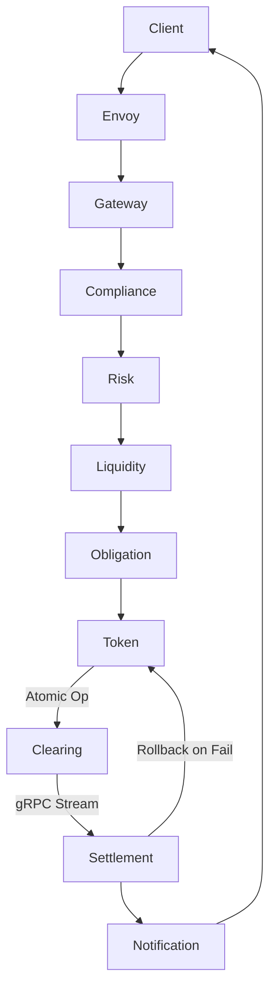

# DELTRAN - ПОЛНАЯ СИСТЕМНАЯ СПЕЦИФИКАЦИЯ

## 📊 ТЕКУЩИЙ СТАТУС РЕАЛИЗАЦИИ
**Дата:** 2025-11-06
**Общий прогресс:** 65% MVP

### Реализованные сервисы:
- ✅ **Token Engine** (100%)
- ✅ **Obligation Engine** (100%)
- ✅ **Liquidity Router** (100%)
- ✅ **Risk Engine** (100%)
- ✅ **Compliance Engine** (100%)
- ⚠️ **Gateway** (40%)
- ✅ **Clearing Engine** (Спецификация готова)
- ✅ **Settlement Engine** (Спецификация готова)
- ✅ **Reporting Engine** (Спецификация готова)
- ✅ **Notification Engine** (Спецификация готова)

---

## 🏗️ АРХИТЕКТУРА СИСТЕМЫ

### Технологический стек:
```yaml
Core Services: Rust 1.75
  - Tokio async runtime
  - gRPC (tonic) для внутренней коммуникации
  - SQLx, Redis clients
  - Токенизация, риски, compliance

API Layer: Go 1.21
  - Gateway (после Envoy proxy)
  - Reporting, Notification engines

Edge Proxy: Envoy
  - mTLS termination
  - Rate limiting
  - Circuit breaking

Database: PostgreSQL 16 + TimescaleDB
Cache: Redis 7.2
Message Bus: NATS JetStream (не RabbitMQ!)
Monitoring:
  - Grafana (операционный мониторинг)
  - Metabase (бизнес-аналитика)
Container: Docker + Kubernetes
```

### Коммуникационные протоколы:
```yaml
External (Banks/Clients):
  - REST API + ISO 20022 (JSON/XML)
  - mTLS + OAuth2 authentication
  - Mock bank APIs для демонстрации

Internal (Service-to-Service):
  - gRPC для стриминга и высокой пропускной способности
  - Используется для: netting, liquidity routing, clearing

Message Queue:
  - NATS JetStream (persistent, exactly-once delivery)
  - Event Sourcing: частичная реализация с append-only audit log
  - CQRS Light: materialized views для чтения

API Gateway Pattern:
  Envoy (edge) → Go Gateway (orchestration) → Services
```

---

## 📋 СПЕЦИФИКАЦИИ СЕРВИСОВ

## 1. GATEWAY SERVICE
**Статус:** ⚠️ 40% реализовано
**Язык:** Go
**Порт:** 8080

### Назначение:
Единая точка входа, маршрутизация, аутентификация, rate limiting

### API Endpoints:
```yaml
# Authentication
POST   /api/v1/auth/login
POST   /api/v1/auth/refresh
POST   /api/v1/auth/logout

# Transactions
POST   /api/v1/transfer
GET    /api/v1/transaction/{id}
GET    /api/v1/transactions

# Banks
GET    /api/v1/banks
GET    /api/v1/banks/{id}
GET    /api/v1/banks/{id}/balance

# Corridors & Rates
GET    /api/v1/corridors
GET    /api/v1/rates/{corridor}

# WebSocket
WS     /ws/notifications
```

### Требуемая доработка:
```go
// services/gateway/main.go

// 1. Добавить реальные HTTP клиенты
type ServiceClients struct {
    TokenEngine      *http.Client // :8081
    ObligationEngine *http.Client // :8082
    LiquidityRouter  *http.Client // :8083
    RiskEngine       *http.Client // :8084
    ComplianceEngine *http.Client // :8086
}

// 2. Реализовать flow транзакции
func (h *Handler) TransferHandler(w http.ResponseWriter, r *http.Request) {
    // 1. Parse request
    // 2. Compliance check → :8086
    // 3. Risk evaluation → :8084
    // 4. Liquidity check → :8083
    // 5. Create obligation → :8082
    // 6. Return response
}

// 3. JWT authentication
func AuthMiddleware(next http.Handler) http.Handler {
    // Validate JWT token
    // Extract user context
}

// 4. Rate limiting
func RateLimitMiddleware(next http.Handler) http.Handler {
    // Per-bank rate limits
    // Circuit breaker integration
}
```

---

## 2. TOKEN ENGINE
**Статус:** ✅ 100% реализовано
**Язык:** Rust
**Порт:** 8081

### Назначение:
Управление токенизированными валютами (xINR, xAED, xUSD и т.д.)

### API Endpoints:
```yaml
POST   /api/v1/tokens/mint         # Создать токены
POST   /api/v1/tokens/burn         # Уничтожить токены
POST   /api/v1/tokens/transfer     # Перевод между банками
POST   /api/v1/tokens/convert      # Конверсия валют
GET    /api/v1/tokens/balance/{id} # Баланс банка
POST   /api/v1/tokens/lock         # Заблокировать для клиринга
POST   /api/v1/tokens/unlock       # Разблокировать
GET    /health
```

### Ключевые структуры:
```rust
pub struct Token {
    pub id: Uuid,
    pub currency: Currency,
    pub amount: Decimal,
    pub bank_id: Uuid,
    pub status: TokenStatus,
    pub clearing_window: i64,
    pub created_at: DateTime<Utc>,
}
```

---

## 3. OBLIGATION ENGINE
**Статус:** ✅ 100% реализовано
**Язык:** Rust
**Порт:** 8082

### Назначение:
Управление обязательствами для instant settlement, неттинг

### API Endpoints:
```yaml
POST   /api/v1/obligations/create           # Создать обязательство
GET    /api/v1/obligations/{id}            # Детали обязательства
GET    /api/v1/obligations/window/{window} # Обязательства по окну
POST   /api/v1/obligations/netting/{window}# Расчет неттинга
POST   /api/v1/obligations/settle          # Исполнить settlement
GET    /api/v1/obligations/current-window  # Текущее окно
```

### Критический алгоритм - Неттинг:
```rust
// Bilateral netting с оптимизацией
pub fn calculate_netting(obligations: Vec<Obligation>) -> NettingResult {
    // 1. Группировка по парам банков
    // 2. Расчет net positions
    // 3. Оптимизация через граф (petgraph)
    // 4. Возврат settlement инструкций

    // Эффективность: 70-90% экономии движения средств
}
```

---

## 4. LIQUIDITY ROUTER
**Статус:** ✅ 100% реализовано
**Язык:** Rust
**Порт:** 8083

### Назначение:
Предсказание ликвидности, оптимизация путей конверсии

### API Endpoints:
```yaml
POST   /api/v1/liquidity/predict     # Предсказать instant settlement
GET    /api/v1/liquidity/optimize    # Оптимальный путь конверсии
GET    /api/v1/liquidity/positions   # Позиции ликвидности
GET    /api/v1/liquidity/gaps        # Дефициты ликвидности
```

### ML предсказание:
```rust
pub fn predict_instant_settlement(
    corridor: &str,
    amount: Decimal,
    time_horizon: i64
) -> PredictionResult {
    // Анализ исторических данных
    // Расчет вероятности встречного потока
    // Confidence score 0-1
}
```

---

## 5. RISK ENGINE
**Статус:** ✅ 100% реализовано
**Язык:** Rust
**Порт:** 8084

### Назначение:
Оценка рисков, dynamic limits, circuit breakers

### API Endpoints:
```yaml
POST   /api/v1/risk/evaluate         # Оценить риск транзакции
GET    /api/v1/risk/limits/{bank}    # Лимиты банка
PUT    /api/v1/risk/limits/{bank}    # Обновить лимиты
GET    /api/v1/risk/circuit-breakers # Состояние circuit breakers
POST   /api/v1/risk/circuit-breakers/{id}/reset
GET    /api/v1/risk/metrics          # Метрики рисков
```

### Risk Scoring:
```rust
pub struct RiskScore {
    pub overall_score: f64,     // 0-100
    pub factors: Vec<RiskFactor>,
    pub decision: RiskDecision,  // Approve/Review/Reject
}

// Факторы риска:
// - Amount risk (25%)
// - Corridor risk (30%)
// - Velocity risk (20%)
// - Bank history (15%)
// - ML prediction (10%)
```

---

## 6. COMPLIANCE ENGINE
**Статус:** ✅ 100% реализовано
**Язык:** Rust
**Порт:** 8086

### Назначение:
AML/KYC проверки, санкции, PEP, генерация SAR/CTR

### API Endpoints:
```yaml
POST   /api/v1/compliance/check      # Полная проверка
GET    /api/v1/compliance/sanctions/update
GET    /api/v1/compliance/reports/sar/{id}
GET    /api/v1/compliance/reports/ctr/{id}
POST   /api/v1/compliance/patterns/train
```

### Sanctions Checking:
```rust
// Fuzzy matching для имен
pub fn check_sanctions(name: &str) -> SanctionsResult {
    // OFAC, EU, UN списки
    // Fuzzy match score > 85% = hit
    // Проверка aliases
}
```

---

## 7. CLEARING ENGINE ✅
**Статус:** Спецификация готова (см. services/clearing-engine/SPECIFICATION.md)
**Язык:** Rust
**Порт:** 50055 (gRPC), 8085 (HTTP)

### Назначение:
Управление клиринговыми циклами, оркестрация неттинга и settlement с атомарными операциями

### Ключевые особенности:
- **Атомарные операции**: Полный контроль финансовых операций с автоматическим откатом
- **6-часовые окна клиринга**: 00:00, 06:00, 12:00, 18:00 UTC
- **gRPC streaming**: Для взаимодействия с obligation и settlement engines
- **Защита от сбоев**: Checkpoint-based recovery

### Критический код - Атомарный контроль:
```rust
pub struct AtomicWindowOperation {
    window_id: i64,
    state: Arc<RwLock<AtomicState>>,
    checkpoints: Vec<Checkpoint>,
}

impl AtomicWindowOperation {
    pub async fn execute(&mut self) -> Result<(), Error> {
        self.state.write().await.clone_from(&AtomicState::InProgress);
        let rollback_point = self.create_rollback_point().await?;

        match self.perform_operation().await {
            Ok(()) => {
                self.state.write().await.clone_from(&AtomicState::Committed);
                Ok(())
            },
            Err(e) => {
                self.rollback(rollback_point).await?;
                self.state.write().await.clone_from(&AtomicState::RolledBack);
                Err(e)
            }
        }
    }
}
```

### gRPC API:
```protobuf
service ClearingService {
    rpc ProcessWindow(WindowRequest) returns (WindowResponse);
    rpc StreamWindowEvents(StreamRequest) returns (stream WindowEvent);
    rpc GetWindowStatus(WindowId) returns (WindowStatus);
}
```

---

## 8. SETTLEMENT ENGINE ✅
**Статус:** Спецификация готова (см. services/settlement-engine/SPECIFICATION.md)
**Язык:** Rust
**Порт:** 50056 (gRPC), 8086 (HTTP)

### Назначение:
Критический сервис финальных расчетов с банками, управление nostro/vostro счетами, атомарные операции

### Ключевые особенности:
- **Атомарные settlement операции**: Автоматический откат при сбоях
- **Fund locking**: Предотвращение двойного списания
- **Reconciliation Engine**: Автоматическая сверка с банками
- **Mock Bank API**: Для демонстрации MVP
- **Multi-rail support**: SWIFT, SEPA, локальные системы

### Критический код - Атомарный Settlement:

```rust
impl SettlementExecutor {
    pub async fn execute_settlement(
        &self,
        request: SettlementRequest,
    ) -> Result<SettlementResult, SettlementError> {
        // Start atomic operation
        let atomic_op = self.atomic_controller
            .begin_operation(request.id)
            .await?;

        match self.perform_atomic_settlement(&request, &atomic_op).await {
            Ok(result) => {
                atomic_op.commit().await?;
                Ok(result)
            }
            Err(e) => {
                atomic_op.rollback().await?;  // Автоматический откат
                Err(e)
            }
        }
    }

    async fn perform_atomic_settlement(
        &self,
        request: &SettlementRequest,
        atomic_op: &AtomicOperation,
    ) -> Result<SettlementResult, SettlementError> {
        // Validate → Lock funds → Transfer → Confirm → Finalize
        // С checkpoint на каждом шаге для возможности отката
    }
}
```

### gRPC API:
```protobuf
service SettlementService {
    rpc ExecuteSettlement(SettlementRequest) returns (SettlementResponse);
    rpc ReconcileAccounts(ReconcileRequest) returns (ReconcileResponse);
    rpc StreamSettlementEvents(StreamRequest) returns (stream SettlementEvent);
}
```

---

## 9. REPORTING ENGINE ✅
**Статус:** Спецификация готова (см. services/reporting-engine/SPECIFICATION.md)
**Язык:** Go
**Порт:** 8087

### Назначение:
Enterprise-grade отчетность с Excel/CSV для Big 4 аудитов, real-time dashboards

### Ключевые особенности:
- **One-click Excel/CSV**: Форматирование под стандарты PwC/Deloitte/EY/KPMG
- **AML/Compliance отчеты**: Автоматическая генерация SAR/CTR
- **Real-time метрики**: Интеграция с Grafana и Metabase
- **Scheduled отчеты**: Ежедневные, недельные, месячные, квартальные
- **ISO 20022 формат**: Для регуляторной отчетности

### Критический код - Excel генератор для аудита:

```go
func (g *ExcelGenerator) GenerateAMLReport(
    data *AMLReportData,
    period ReportPeriod,
) (*bytes.Buffer, error) {
    f := excelize.NewFile()

    // Создание листов для Big 4 аудита
    sheets := []string{
        "Executive Summary",
        "Transaction Analysis",
        "Risk Indicators",
        "Suspicious Activities",
        "Sanctions Screening",
    }

    // Применение стандартов форматирования Big 4
    g.applyAuditFormatting(f)

    // Добавление цифровой подписи и timestamp
    g.addAuditTrail(f, data.GeneratedBy, time.Now())

    return buf, nil
}

// Scheduler для автоматических отчетов
func (s *ReportScheduler) Start(ctx context.Context) error {
    // Daily reports at 00:30 UTC
    s.cron.AddFunc("0 30 0 * * *", func() {
        s.generateDailyReports(ctx)
    })

    // Quarterly compliance reports
    s.cron.AddFunc("0 0 3 1 1,4,7,10 *", func() {
        s.generateQuarterlyReports(ctx)
    })
}
```

### API Endpoints:
```yaml
POST   /api/v1/reports/generate      # Генерировать отчет
GET    /api/v1/reports/{id}          # Получить отчет
GET    /api/v1/reports               # Список отчетов
DELETE /api/v1/reports/{id}          # Удалить отчет
GET    /api/v1/reports/templates     # Доступные шаблоны
POST   /api/v1/reports/schedule      # Запланировать отчет
```

---

## 10. NOTIFICATION ENGINE ✅
**Статус:** Спецификация готова (см. services/notification-engine/SPECIFICATION.md)
**Язык:** Go
**Порт:** 8085 (HTTP), 8086 (WebSocket)

### Назначение:
High-performance real-time уведомления через WebSocket, email/SMS, push notifications

### Ключевые особенности:
- **WebSocket Hub**: 10,000+ concurrent соединений
- **NATS JetStream**: Гарантированная доставка событий
- **Template Engine**: i18n поддержка, HTML/text шаблоны
- **Rate Limiting**: Защита от спама
- **Retry Logic**: Экспоненциальный backoff для failed доставок

### Критический код - WebSocket Hub:

```go
type Hub struct {
    clients    map[string]*Client
    broadcast  chan *Message
    register   chan *Client
    unregister chan *Client
    mutex      sync.RWMutex
    redis      *redis.Client  // Для horizontal scaling
}

func (h *Hub) Run(ctx context.Context) {
    ticker := time.NewTicker(30 * time.Second)  // Heartbeat
    defer ticker.Stop()

    for {
        select {
        case client := <-h.register:
            h.mutex.Lock()
            h.clients[client.ID] = client
            h.mutex.Unlock()
            // Store in Redis для масштабирования
            h.redis.Set(ctx, "ws:conn:"+client.ID, client.ServerID, 5*time.Minute)

        case message := <-h.broadcast:
            h.sendToClients(message)

        case <-ticker.C:
            h.pingClients()  // Keep-alive
        }
    }
}

// NATS Consumer для событий
func (ec *EventConsumer) SubscribeToEvents(ctx context.Context) error {
    eventTypes := []string{
        "payment.initiated",
        "payment.completed",
        "settlement.completed",
        "compliance.alert",
        "risk.threshold.exceeded",
    }

    for _, eventType := range eventTypes {
        // Создание durable consumer для гарантированной доставки
        _, err := ec.jetStream.AddConsumer(streamName, &nats.ConsumerConfig{
            Durable:       "notification-engine",
            DeliverPolicy: nats.DeliverAllPolicy,
            AckPolicy:     nats.AckExplicitPolicy,
            MaxDeliver:    3,
        })
    }
}
```

### API Endpoints:
```yaml
WS     /ws                           # WebSocket connection
POST   /api/v1/notifications/send    # Отправить уведомление
GET    /api/v1/notifications         # История уведомлений
POST   /api/v1/subscriptions         # Подписаться на события
DELETE /api/v1/subscriptions/{id}    # Отписаться
GET    /api/v1/subscriptions         # Список подписок
```

---

## 🔄 ИНТЕГРАЦИИ МЕЖДУ СЕРВИСАМИ

### Communication Matrix:
```yaml
REST (External):
  - Client → Envoy → Gateway
  - Banks → Gateway (ISO 20022 JSON/XML)
  - Reporting → Banks (Excel/CSV downloads)

gRPC (Internal High-throughput):
  - Clearing ↔ Obligation (streaming netting data)
  - Clearing ↔ Settlement (settlement instructions)
  - Settlement ↔ Banks (mock APIs for MVP)
  - Services → Risk (real-time risk evaluation)

NATS JetStream (Async Events):
  - All services → Notification Engine
  - Settlement → Reporting (for audit trail)
  - Compliance → Gateway (alerts)
  - Risk → Circuit Breaker events
```

### Transaction Flow with Atomic Controls:


### Event Topics (NATS JetStream):
```yaml
# Persistent streams with exactly-once delivery
streams:
  - name: transactions
    subjects: [transactions.created, transactions.completed, transactions.failed]
    retention: 7d

  - name: settlement
    subjects: [settlement.initiated, settlement.completed, settlement.rolled_back]
    retention: 30d

  - name: compliance
    subjects: [compliance.alert, compliance.sar, compliance.ctr]
    retention: 90d

  - name: notifications
    subjects: [notifications.*]
    retention: 1d
```

---

## 🚀 ПРЕДЛАГАЕМЫЕ УЛУЧШЕНИЯ

### 1. **Event Sourcing + CQRS**
```rust
// Все изменения как события
pub struct Event {
    pub aggregate_id: Uuid,
    pub event_type: String,
    pub event_data: Value,
    pub event_version: i32,
    pub occurred_at: DateTime<Utc>,
}

// Отдельные модели для чтения и записи
pub struct WriteModel { /* оптимизировано для записи */ }
pub struct ReadModel { /* оптимизировано для чтения */ }
```

### 2. **API Gateway Upgrade (Kong/Envoy)**
- Встроенная аутентификация (OAuth2, JWT)
- Rate limiting per client
- Request/Response transformation
- Caching
- Monitoring & Analytics
- Circuit breakers

### 3. **Saga Pattern для распределенных транзакций**
```rust
pub struct TransactionSaga {
    steps: Vec<SagaStep>,
    compensations: Vec<CompensationStep>,
}

impl TransactionSaga {
    pub async fn execute(&self) -> Result<()> {
        for (i, step) in self.steps.iter().enumerate() {
            if let Err(e) = step.execute().await {
                // Откат предыдущих шагов
                for j in (0..i).rev() {
                    self.compensations[j].compensate().await?;
                }
                return Err(e);
            }
        }
        Ok(())
    }
}
```

### 4. **Distributed Tracing (OpenTelemetry)**
```rust
use opentelemetry::{trace::Tracer, global};

let tracer = global::tracer("deltran");
let span = tracer.start("process_transaction");
// ... операция
span.end();
```

### 5. **Feature Flags для безопасного деплоя**
```rust
if feature_flag("instant_settlement_v2") {
    // новая логика
} else {
    // старая логика
}
```

### 6. **Multi-tenancy для банков**
```rust
// Изоляция данных по банкам
pub struct TenantContext {
    pub bank_id: Uuid,
    pub permissions: Vec<Permission>,
    pub limits: Limits,
}

// Row-level security в PostgreSQL
CREATE POLICY bank_isolation ON transactions
    FOR ALL
    USING (bank_id = current_setting('app.current_bank_id')::uuid);
```

---

## 📊 МЕТРИКИ И МОНИТОРИНГ

### Ключевые метрики (Prometheus):
```yaml
# Business metrics
deltran_transactions_total
deltran_transactions_value_total
deltran_instant_settlements_rate
deltran_netting_efficiency_percent
deltran_settlement_time_seconds

# Technical metrics
deltran_service_uptime
deltran_api_latency_seconds
deltran_database_connections
deltran_kafka_lag
deltran_error_rate
```

### SLA Targets:
- Availability: 99.99% (52 минуты downtime/год)
- Latency P95: < 100ms
- Latency P99: < 500ms
- Throughput: 3000+ TPS
- Instant Settlement: < 30 секунд
- Netting Efficiency: > 70%

---

## 🔐 БЕЗОПАСНОСТЬ

### Security Checklist:
- [x] TLS 1.3 для всех коммуникаций
- [x] mTLS между сервисами
- [x] JWT с rotation для API
- [x] Rate limiting per bank
- [x] SQL injection protection (prepared statements)
- [x] Input validation на всех endpoints
- [x] Audit logging всех операций
- [ ] Secrets management (HashiCorp Vault)
- [ ] WAF (Web Application Firewall)
- [ ] DDoS protection
- [ ] Penetration testing

---

## 📝 ПЛАН РЕАЛИЗАЦИИ MVP

### Фаза 1: Инфраструктура (День 1)
1. **Envoy Proxy Setup** - Edge proxy с mTLS (2 часа)
2. **NATS JetStream** - Замена Kafka на NATS (2 часа)
3. **Database Migrations** - Схемы для новых сервисов (1 час)

### Фаза 2: Core Services (День 2-3)
4. **Clearing Engine** - Реализация по спецификации (4 часа)
   - Atomic operations controller
   - gRPC server для streaming
   - Scheduler для 6-часовых окон

5. **Settlement Engine** - Реализация по спецификации (4 часа)
   - Atomic settlement executor
   - Fund locking mechanism
   - Mock bank integrations
   - Reconciliation engine

### Фаза 3: Supporting Services (День 4)
6. **Notification Engine** - Реализация по спецификации (3 часа)
   - WebSocket hub (10k connections)
   - NATS consumer setup
   - Template engine с i18n

7. **Reporting Engine** - Реализация по спецификации (3 часа)
   - Excel generator для Big 4
   - Scheduled reports cron
   - Materialized views для performance

### Фаза 4: Integration (День 5)
8. **Gateway Upgrade** - Интеграция с Envoy и gRPC (2 часа)
9. **End-to-End Testing** - Полный transaction flow (2 часа)
10. **Monitoring Setup** - Grafana + Prometheus (2 часа)

**Общая оценка: 5 рабочих дней (40 часов)**

---

## 🎯 КРИТЕРИИ ГОТОВНОСТИ

### MVP готов когда:
- [ ] Все 10 сервисов запущены и здоровы
- [ ] End-to-end транзакция проходит успешно
- [ ] Instant settlement работает < 30 секунд
- [ ] Netting показывает > 70% эффективность
- [ ] Risk & Compliance блокируют опасные транзакции
- [ ] Отчеты генерируются корректно в Excel для Big 4
- [ ] Атомарные операции корректно откатываются при сбоях
- [ ] WebSocket поддерживает 1000+ соединений
- [ ] NATS JetStream гарантирует доставку событий
- [ ] Система выдерживает 100+ TPS

---

## ⚠️ КРИТИЧЕСКИЕ ТРЕБОВАНИЯ БЕЗОПАСНОСТИ

### Финансовая безопасность:
1. **Атомарность операций** - Все финансовые операции должны быть атомарными с автоматическим откатом
2. **Fund Locking** - Блокировка средств перед settlement для предотвращения двойного списания
3. **Reconciliation** - Ежедневная автоматическая сверка с банками
4. **Audit Trail** - Полный append-only лог всех операций
5. **Idempotency** - Все операции должны быть идемпотентными

### Пример критического кода:
```rust
// ОБЯЗАТЕЛЬНО для всех финансовых операций
match atomic_operation.execute().await {
    Ok(result) => {
        atomic_operation.commit().await?;
        audit_log.record_success(&result).await?;
    }
    Err(e) => {
        atomic_operation.rollback().await?;
        audit_log.record_failure(&e).await?;
        alert_team(&e).await?;
    }
}
```

---

## 📚 ДОПОЛНИТЕЛЬНАЯ ДОКУМЕНТАЦИЯ

Детальные спецификации каждого сервиса находятся в:
- `services/clearing-engine/SPECIFICATION.md` - Полная спецификация clearing engine с атомарными операциями
- `services/settlement-engine/SPECIFICATION.md` - Settlement с fund locking и reconciliation
- `services/notification-engine/SPECIFICATION.md` - WebSocket hub и NATS integration
- `services/reporting-engine/SPECIFICATION.md` - Excel/CSV генерация для аудита

---

*Эта спецификация является единым источником истины для системы DelTran.*
*Последнее обновление: 2025-11-06*
*Версия: 2.0 (с архитектурными решениями пользователя)*